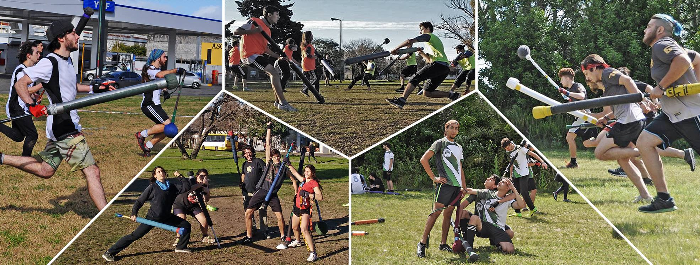

El Jugger es un nuevo deporte alternativo. Todas las prácticas y eventos son gratuitos. ¡Acercate a participar!

# Entrenamientos

* Martes de 16 a 18hs, [Campo de Deportes de la UNLP](http://deportes.unlp.edu.ar/) (50 y 115)
* Miércoles de 16 a 18hs, [Campo de Deportes de la UNLP](http://deportes.unlp.edu.ar/) (50 y 115)
* Sábados a la tarde en el Parque Saavedra (65 y 12). El horario exacto se publica cada semana en [Jugger La Plata (facebook)](https://www.facebook.com/groups/883679841713425/)

# AJuLP
La Asociación de Jugger de La Plata (AJuLP) está formada por un grupo de jugadores que desde el 2013 promueve el deporte en la ciudad y el país.
